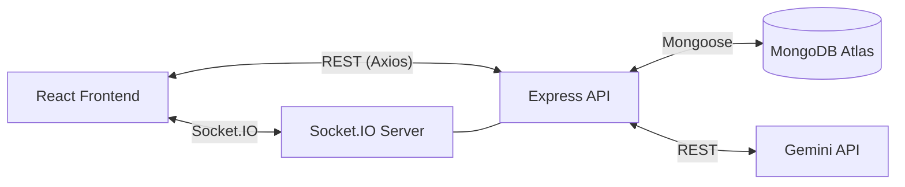
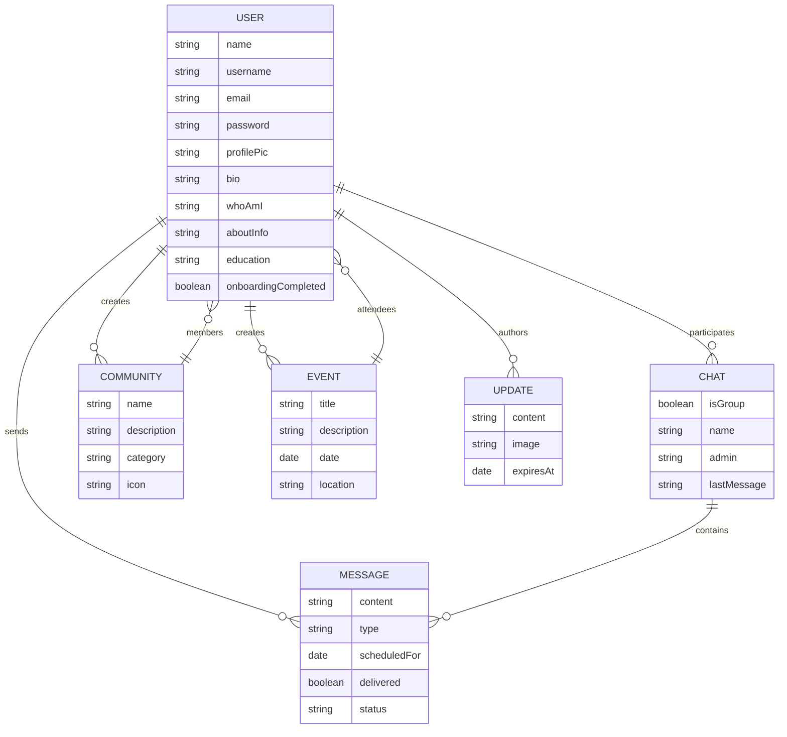
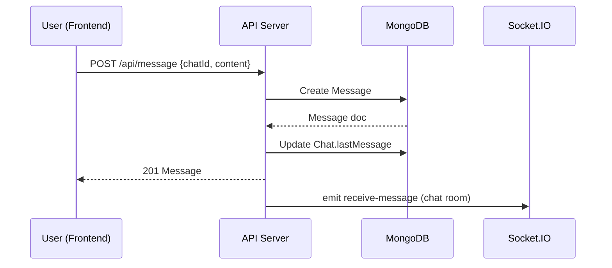
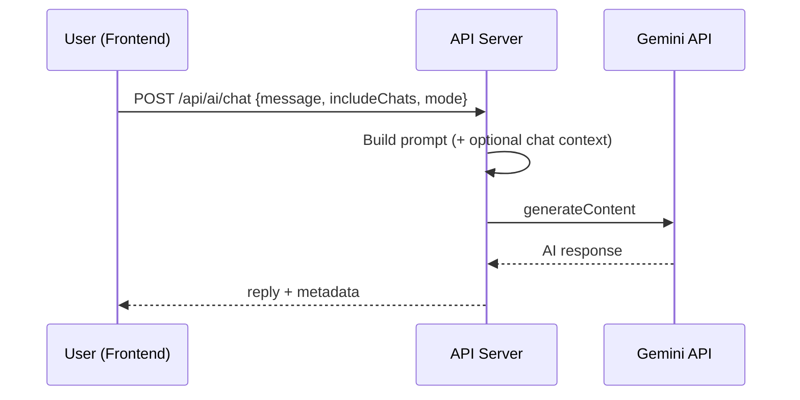

# Cohort — Project Documentation

## Abstract
Cohort is a full‑stack social communication platform that provides real‑time chat, communities, events, user updates, and an AI assistant. The system uses a React (Vite) frontend, an Express + Socket.IO backend, and MongoDB for persistence. This document summarizes architecture, modules, data model, APIs, and operational details in a standard end‑semester project format.

## Objectives
1. Enable secure user authentication and onboarding.
2. Provide real‑time 1‑1 and group chat with typing indicators and read receipts.
3. Support user social features: friends, communities, events, and updates.
4. Add AI assistant features including translation for Indian languages.
5. Deliver a responsive, modern UI with real‑time updates.

## Scope
The project covers frontend UI, backend APIs, WebSocket events, and a MongoDB data store. It does not include automated tests or production deployment configuration.

## Technology Stack
1. Frontend: React 19, Vite, React Router, Axios, Socket.IO client, Three.js.
2. Backend: Node.js, Express 5, Socket.IO, Mongoose, JWT, Multer.
3. Database: MongoDB Atlas.
4. AI: Gemini API via REST.

## System Requirements
1. Node.js 18+ and npm.
2. MongoDB Atlas connection string.
3. Environment variables for JWT and Gemini.

## High‑Level Architecture

## Module Overview
1. Authentication: Register, login, JWT protection.
2. User Management: Profile, onboarding, friends, requests.
3. Chat: 1‑1 and group chats, message history, read receipts.
4. Real‑Time: Online status, typing indicators, live message delivery.
5. Communities: Create, join, leave, browse.
6. Events: Create and RSVP within community or general.
7. Updates: 24‑hour expiring posts (stories‑like).
8. AI Assistant: Chat and translation with optional chat context.

## Data Model (ER Diagram)

## Data Flow (Message Send)

## AI Request Flow

## Backend API Summary
Base URL: `http://localhost:5000/api`

Auth
1. `POST /auth/register` — Register user.
2. `POST /auth/login` — Login user.

User
1. `GET /user/profile` — Get current profile.
2. `PUT /user/profile` — Update profile (multipart).
3. `POST /user/onboarding` — Save onboarding info.
4. `GET /user` — Search users.
5. `GET /user/friends` — Friend list.
6. `GET /user/friend-requests` — Incoming/outgoing requests.
7. `POST /user/friend-request/:username` — Send request.
8. `POST /user/friend-request/:userId/accept` — Accept.
9. `POST /user/friend-request/:userId/reject` — Reject.
10. `GET /user/check-username/:username` — Username availability.

Chat
1. `POST /chat` — Create 1‑1 chat.
2. `POST /chat/group` — Create group chat.
3. `GET /chat` — List user chats.

Message
1. `POST /message` — Send message (optionally scheduled).
2. `GET /message/:chatId` — Get messages.
3. `PUT /message/:chatId/read` — Mark messages as read.

Community
1. `GET /communities` — List communities.
2. `POST /communities` — Create community.
3. `POST /communities/:id/join` — Join.
4. `POST /communities/:id/leave` — Leave.

Event
1. `GET /events` — List relevant events.
2. `POST /events` — Create event.
3. `POST /events/:id/rsvp` — RSVP or un‑RSVP.

Updates
1. `GET /updates` — List active updates from friends/self.
2. `POST /updates` — Create update with optional image.

AI
1. `POST /ai/chat` — AI chat or translate.

## Socket.IO Events
Client to Server
1. `user-online` — Notify online status.
2. `join-chat` — Join room by chatId.
3. `send-message` — Emit message to room.
4. `typing-start` — Start typing indicator.
5. `typing-stop` — Stop typing indicator.
6. `mark-messages-read` — Broadcast read status.

Server to Client
1. `user-status-change` — Online/offline broadcast.
2. `receive-message` — New message in room.
3. `user-typing` — Typing indicators.
4. `messages-read` — Read receipts.

## Security Considerations
1. JWT‑based auth with protected routes.
2. Password hashing with bcrypt.
3. Input validation at route level.
4. Media uploads restricted to image types.
5. `.env` secrets must not be committed in production.

## Installation and Run
Backend
1. `cd cohortBackEnd`
2. `npm install`
3. Create `.env` with `PORT`, `MONGO_URI`, `JWT_SECRET`, `GEMINI_API_KEY`, `GEMINI_MODEL`.
4. `npm run dev`

Frontend
1. `cd cohortFront`
2. `npm install`
3. `npm run dev`

## Project Structure (Top‑Level)
1. `cohortBackEnd/src` — Express app, routes, models, middleware.
2. `cohortFront/src` — React UI, pages, API clients, socket.

## Limitations
1. No automated tests configured.
2. AI availability depends on Gemini API key quota.
3. File upload endpoint for message attachments is referenced in frontend but not implemented in backend routes.

## Future Enhancements
1. Add unit and integration tests (Jest, Supertest, React Testing Library).
2. Implement message attachment upload endpoint.
3. Add rate limiting and request validation middleware.
4. Improve deployment automation (Docker, CI/CD).

## Conclusion
Cohort demonstrates a complete real‑time communication platform with social and AI features. The architecture is modular, using clear separation between frontend UI, backend services, and data storage, making it suitable for further extension and production hardening.
